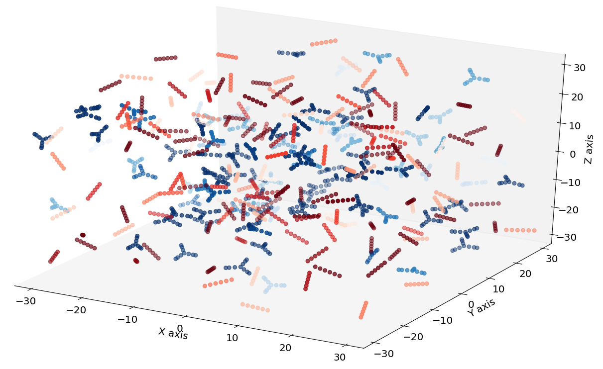
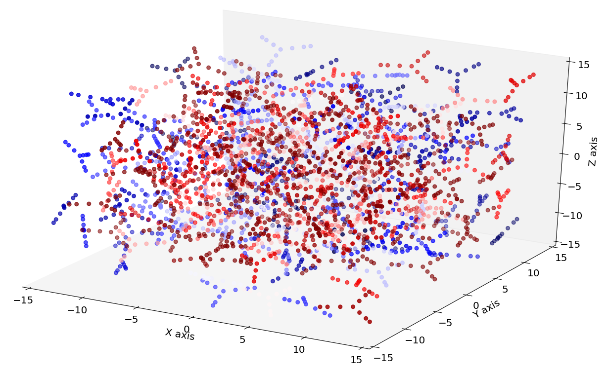

# **CG initial configurations of DNA Hydrogels for MD**
---

This is a set of programs with codes for the generation of CG
(Coarse Grained) initial configurations of building blocks that 
are used in MD (Molecular Dynamics) simulations of DNA hydrogels.
The generated files can be utilised along with 
[LAMMPS](https://lammps.sandia.gov/). 
Please refer to Prerequisites section for more information.

## **Introduction**

Even if DNA is widely known as the molecule that encodes all biological information in living organisms, 
it is also a versatile building block that is used in DNA Nanotechnology. 
DNA has been used as a structural material for nanoscale devices, and can be 
used for biomedical applications, and therapeutics.
A group of promising materials for controlled drug delivery are polymeric 
networks made entirely of DNA building blocks, called DNA hydrogels.
A key objective in DNA-based material science is understanding and precisely 
controlling the mechanical properties of 
[DNA hydrogels](https://www.pnas.org/content/pnas/115/32/8137.full.pdf). 
Simulations can also assist in the description of the mechanical properties 
of DNA hydrogels. For this reason, a CG model was designed by the group of 
[Prof Erika Eiser](https://www.phy.cam.ac.uk/directory/eisere), and it is 
described extensively in the publication: 
[Structural and Linear Elastic Properties of DNA Hydrogels by Coarse-Grained 
Simulations](https://christopherjness.github.io/papers/acs.macromol.8b01948.pdf).

The scripts included in this repository are used to create initial configurations that 
will be utilised in MD simulations of DNA hydrogels. These initial configurations are 
designed in a CG fashion where beads represent parts of dsDNA (double stranded DNA), 
and patches represent ssDNA (single stranded DNA). The building blocks of 
DNA hydrogel are Y-shaped molecules of two types.
Additional initial configurations of Y-shaped molecules and linear linkers can 
also be derived by the scripts. This additional configuration is described by  
Xing et. al., in the publication 
[On the Role of Flexibility in Linker-Mediated DNA Hydrogels](https://arxiv.org/pdf/1909.05611.pdf) 

## **Getting started**
The directories are arranged as follows:
.
|-- generate_structures
|   |-- generate_pseudo_rigid_rod/
|   |   |--
|   |-- generate_pseudo_y_l
|   |   |--
|   |-- generate_pseudo_y_y
|   |   |--
|-- img
|-- LICENSE
|-- README.md
|-- tests

## **Prerequisites**
The generated files can be used in LAMMPS as an input file that 
contains information on the geometry of the CG initial configuration.
A *.run* file including information on the simulation is also required. 
The *.run* file configures the appropriate Canonical Ensemble, with 
the Langevin thermostat, hence no explicit solvent needs to be used. 
Examples of *.run* files are not included yet.

### **LAMMPS *.run* file**
Description of the *.run* will be added in due time.

### **Python**
The codes provided in this repository are written in Python 3.6, 
and support newer Python versions.
It is advised that the user creates a virtual environment if 
they want to make amendments to the codes.
Packages for creating and using virtual environments are 
[mkvirtualenv](https://realpython.com/python-virtual-environments-a-primer/) 
and [pyenv](https://realpython.com/intro-to-pyenv/).
After initialising a virtual environment, with one of the aforementioned 
Python versions, the package requirements can be installed with the command 
`pip install -r requirements.txt`.

## **Information on input and output**
The program provides two arguments that can be parsed. 
These are:
1. `-g` for generating a new configuration.
2. `-r` for plotting an existing configuration.

### **Example output**
Creating a structure comprising 300 Y-shaped molecules in a cubic box 
with edge length 30 is visualised in the following figure.

A structure comprising 100 Y-shaped molecules with 150 linear 
linkers in a box with edge 30 is presented in the following figure.

## **Further Amendments**
There is a number of corrections/amendments that will be done 
in due time. These are:
- Information on running the scripts.
- Discussion on randomness of initial configurations.
- Discussion on reduced units.
- Merge scripts of the different initial configurations in one.
- Finalise the possible 
- Include example *.run* file.
- Include description of MD in LAMMPS.
- Include tests.

## **Authors** 
If you have any suggestions or corrections, 
please contact [Iria Pantazi](iria.a.pantazi@gmail.com).

